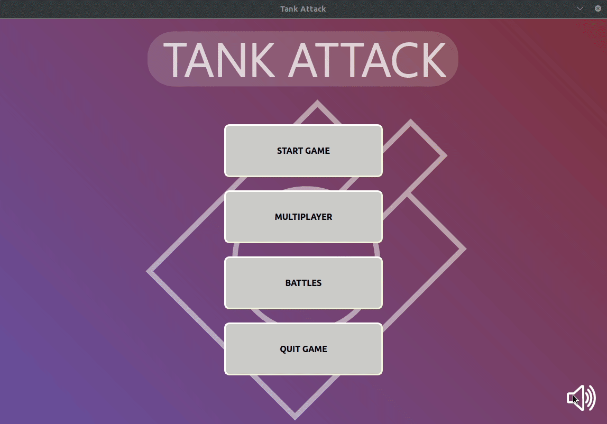

# Project 17-TankAttack :memo: 	

**TankAttack je 2D multiplayer (komunikacija 2 igrača preko mreže) igrica koja simulira bitku između tenkova koji se nalaze u lavirintu.**  

## Table of contents :sunglasses:	
* [General info](#general-info-point_down)
* [Screenshots](#screenshots-dart)
* [Technologies](#technologies-wrench)
* [Setup](#setup-pencil2)
* [Game controls](#game-controls-selfie)
* [Developers](#developers-punch-muscle)

## General info :point_down:
**Cilj igrice je eliminisati protivnika pre nego što on eliminiše tebe.
Inicijalno ispaljuju tenkovsko đule, a tokom bitke postoji mogućnost skupljanja supermoćnog oružja koja olakšavaju eliminaciju protivnika kao i skupljanje srca koja omogucavaju punjenje helti na maksimum.
Pobednik je onaj tenk koji prvi ostvari 3 pobede na razlicitim mapama.
Igrica ima različite teksture i modove kao što je simulacija bitke između dva igrača koji igraju na istom računaru, kao i mogucnost igranja preko mreze.**

## Screenshots :dart:
Snimke svih modova igre mozete pogledati na sledecem youtube linku:
* [tank_attack](https://www.youtube.com/playlist?list=PLzcUic-tf2LSq8aBPbCxmtnR_erb_Fu7O)



## Technologies :wrench:
- **Qt i QtCreator - Verzija >= 5.12**
- **qmake - Verzija >= 5.12**
- **C++ jezik - Verzija c++17**

## Setup :pencil2:
Prvo je potrebno klonirati repozitorijum i pozicionirati se u njega:
```
$ git clone https://gitlab.com/matf-bg-ac-rs/course-rs/projects-2020-2021/17-tankattack.git
$ cd 17-tankattack/
```

Primer prevodjenja i pokretanja programa koriscenjem qmake-a i Makefile:
``` 
$ mkdir ../build_tank_attack
$ qmake -makefile -o ../build_tank_attack/Makefile "CONFIG+=tank_attack" tank_attack.pro
$ cd ../build_tank_attack
$ make 
$ ./tank_attack
```
Aplikaciju mozete pokrenuti takodje preko QtCreator-a, kako ga instalirati:
```
sudo apt-get install build-essential
sudo apt-get install qtcreator
sudo apt-get install qt5-default
```
Da biste imali zvuk tokom igrice potrebno je da instalirate neke dodatne biblioteke:
```
$ sudo apt-get update
$ sudo apt-get install qtmultimedia5-dev libqt5multimediawidgets5 libqt5multimedia5-plugins libqt5multimedia5
```

## Game controls :selfie:
**Kontrole crvenog tenka:**       
- ```w``` kretanje unapred
- ```s``` kretanje unazad
- ```a``` rotacija u levo
- ```d``` rotacija u desno
- ```space``` ispaljivanje rakete

**Kontrole plavog tenka:**       
- ```up``` kretanje unapred
- ```down``` kretanje unazad
- ```left``` rotacija u levo
- ```right``` rotacija u desno
- ```enter``` ispaljivanje rakete

## Developers :punch: :muscle:

- [Nikola Mićić, 170/2017](https://gitlab.com/nikolamicic) :boy:
- [Luka Miletić, 91/2017](https://gitlab.com/lukamileticc) :man:
- [Nikola Lazarević, 267/2017](https://gitlab.com/_nikolalazarevic) 
- [Slobodan Jovanović, 186/2017](https://gitlab.com/Sloba98) :man_with_gua_pi_mao:
- [Mihailo Trišović, 474/2018](https://gitlab.com/mihailotrisovic) :baby:
